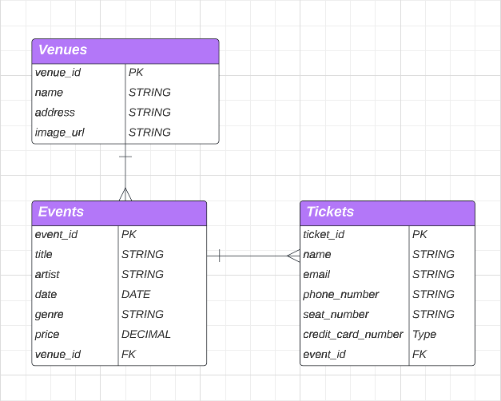

# tickit_app_backend

# Tick-iT

## The Team

### Toni Hall

    
Socials

- [Github]
- [LinkedIn]

### Tyler Carter

    
Socials

- [Github]
- [LinkedIn]

### Austin Holland

    
Socials

- [Github]
- [LinkedIn]

## ERD

## Models

    
Venues

### Venues
The Venues model will store all data realting to each venue that our app covers. Each venue can host multiple events. Venue fields are: 
- venue_id - PK
- name - string
- address - string
- max_capacity - integer

    
Events

### Events

    
Tickets

### Tickets

